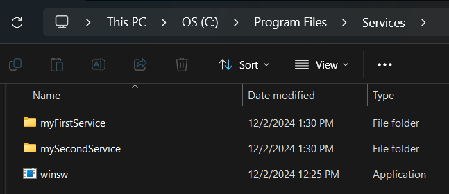
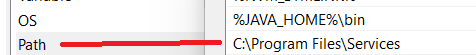
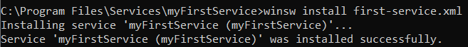

# How to run Spring Boot Application as Windows Service

## Creating our Spring Boot Application

### Dependencies

Consider to add these dependencies to our project:

- Spring Web
- Spring DevTools

And after that, add these both dependencies too:

```xml
<dependency>
    <groupId>org.slf4j</groupId>
    <artifactId>slf4j-api</artifactId>
    <version>2.0.9</version>
</dependency>
<dependency>
    <groupId>ch.qos.logback</groupId>
    <artifactId>logback-classic</artifactId>
    <version>1.4.12</version>
</dependency>
```
Then, reload the project with maven.

### Required Annotations

In our main Spring Boot Application Class, we need to add the @EnableScheduling Annotation. This enables Spring's scheduled task execution capability.


Now, we can create our Component with our Scheduled task, like this:


- _@Scheduled(fixedRate = 10000):_ Every 10 seconds our application will execute the SayHello() function.


## WinSW Global Configuration

The goal of this configuration is to use the same winsw.exe and manage all the services that we want to run as Windows Service.

1. Locate the winsw.exe in common place in your computer
2. Update PATH variable, and add the folder path where the winsw.exe was located

    
    
    
3. Verify the configuration. In a Command Prompt type __winsw -?__

    
4. Now, try to install sa new Windows Service:

    

## WinSW Project Configuration

WinSW wraps and manages any application as a Windows service. In this case, we want to execute JAR files.

Steps:
1. Download and rename the executable file, for example demo-service.exe
2. In the same directory, create a XML config file named demo-service.xml with the next specification: 
    ```xml
    <service>
        <id>MyService</id>
        <name>MyService</name>
        <description>Spring Boot App running as Windows service</description>
        <executable>java</executable>
        <arguments>-jar "demo-service-0.0.1-SNAPSHOT.jar"</arguments>
        <logmode>roll</logmode>
    </service>
    ```
3. In the same directory, paste the JAR file:

   
4. Open a Command Promtp terminal, install and start the service:

   

The Java Application is running and reporting in the specified log file: 


References:
- https://github.com/winsw/winsw
- https://docs.spring.io/spring-framework/docs/current/javadoc-api/org/springframework/scheduling/annotation/EnableScheduling.html
- https://spring.io/guides/gs/scheduling-tasks


